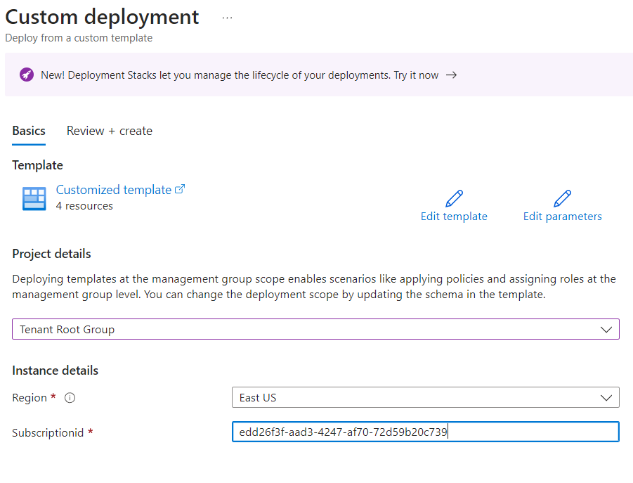
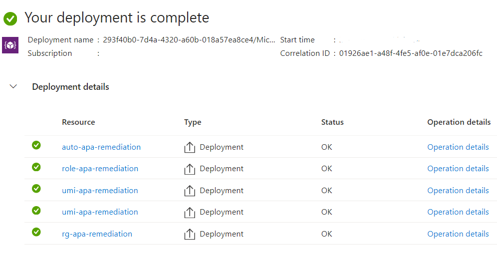
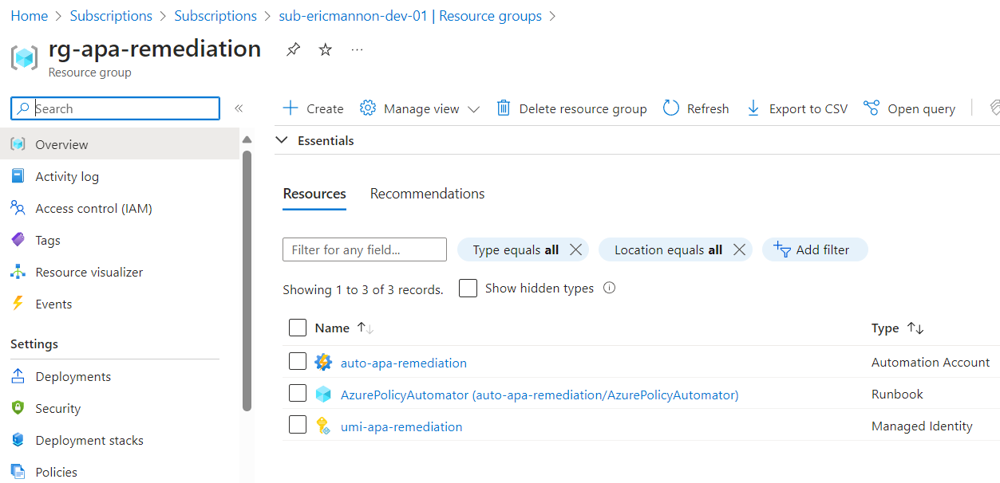
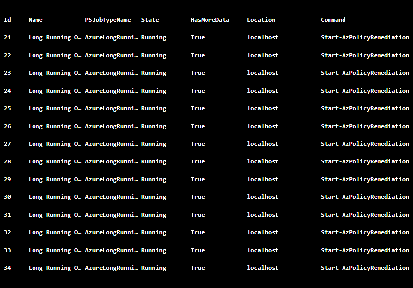
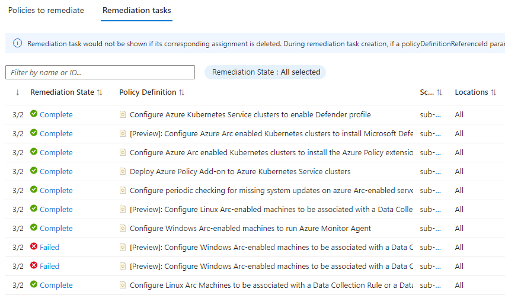

# AzurePolicyAutomator

This project deploys a AzurePolicyAutomator and activates Azure Policy Remediation Tasks every (12) hours.

## What is AzurePolicyAutomator?

Azure Automation is a cloud-based service from Microsoft that allows developers and system administrators to automate the manual, long-running, error-prone, and frequently repeated tasks that are commonly performed in a cloud and enterprise environment. 

Azure Policy Deploy-If-Not-Exists (DINE) is a policy effect in Azure Policy that provides a way to ensure your Azure environment is in compliance with specific rules. The DINE effect is used to automatically deploy resources if they do not already exist, based on the policy definition. This is particularly useful for enforcing certain configurations in your Azure environment. This helps to ensure that your Azure environment is always in compliance with your organization's standards and best practices. In addition to deploying resources, DINE policies can also be used to execute scripts or functions, providing a flexible way to enforce compliance and manage your Azure environment.

Azure Policy Remediation Tasks are automated processes that help bring resources back into compliance with the assigned policies. When a policy or initiative is assigned that includes the DeployIfNotExists or Modify effect, and non-compliant resources are found, a remediation task is triggered. Remediation tasks can be created automatically during policy assignment or manually after the policy assignment. They apply the changes required to make the non-compliant resources compliant with the policy. For example, if a policy requires that all virtual machines have a specific extension installed, a Remediation Task will automatically install the extension on any existing or newly created virtual machines that don't have it.

DINE Azure Policies only apply once automatically and trys to enforce that state. AzurePolicyAutomator makes this a continuous process so Azure policy is regularly running & returning the environment to desired state. 

-Was the Arc VM offline when the 1st Remediation Task ran? APA will try again in the next (12) hours.

-Did somebody remove a required Resource Type extension accidentally? APA will try to resolve it in the next (12) hours. 

AzurePolicyAutomator enables eventually consistent Azure Policy goverance for All Policy assignments in the Azure tenant. 

   

## Overview

This project deploys the following Azure resource types:

- Azure Automation Account 
- User Managed Identity

## Deployment

1. Hit the blue "Deploy" button below.

2. Specify the Azure Subscription.

   

3. Review the deployed componets and wait for the 1st Job to start in the next 60 minutes. 

   

   

   

   
